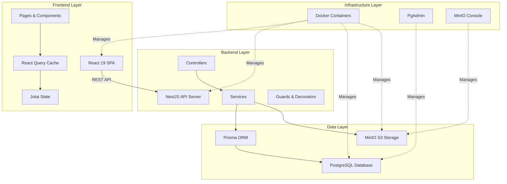
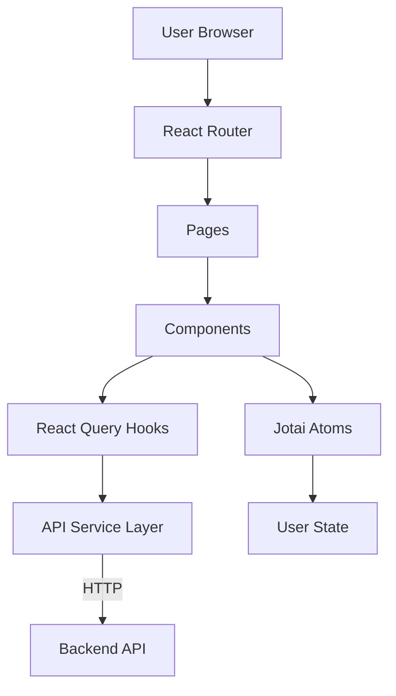
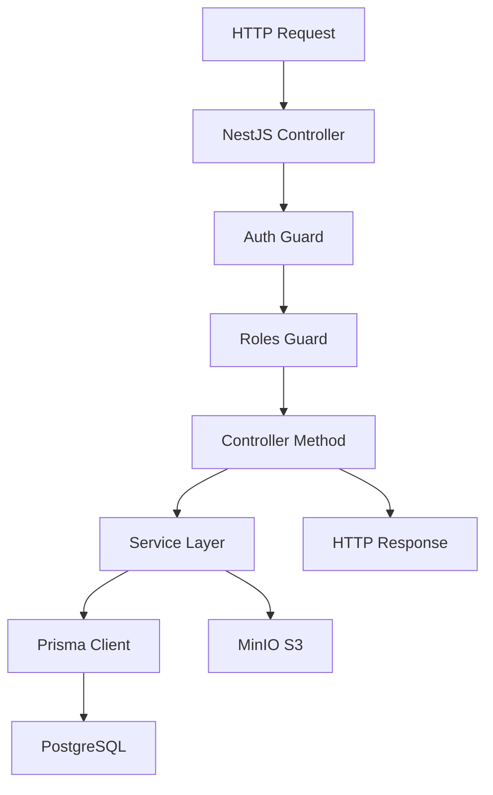
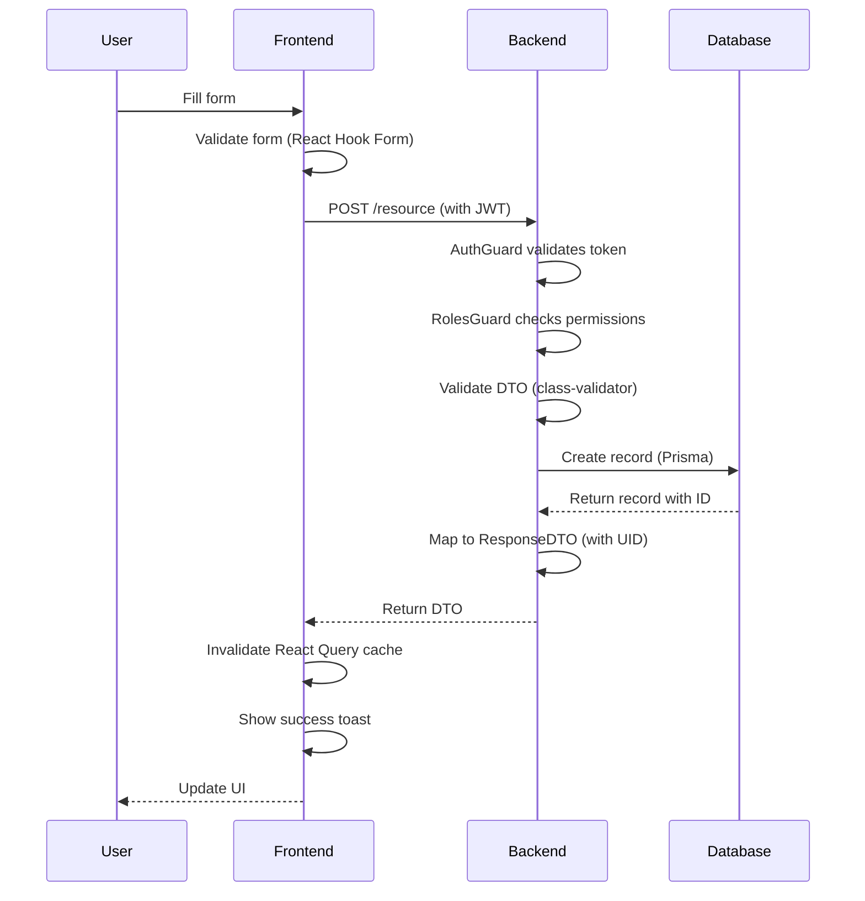
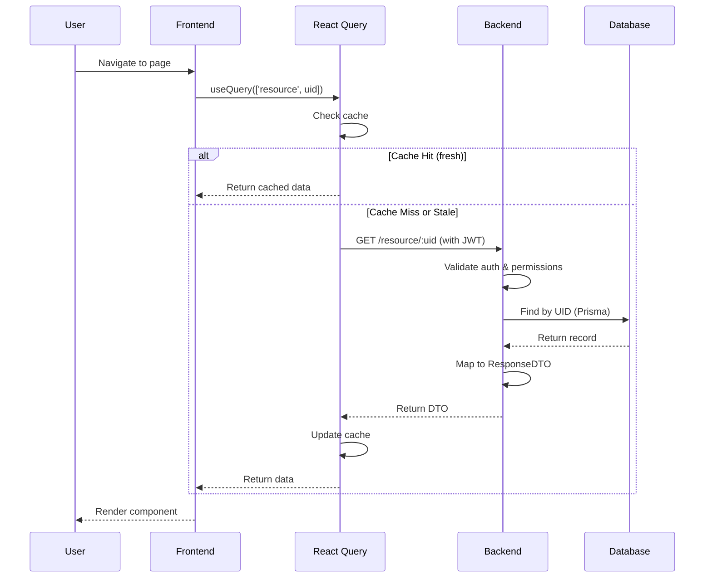
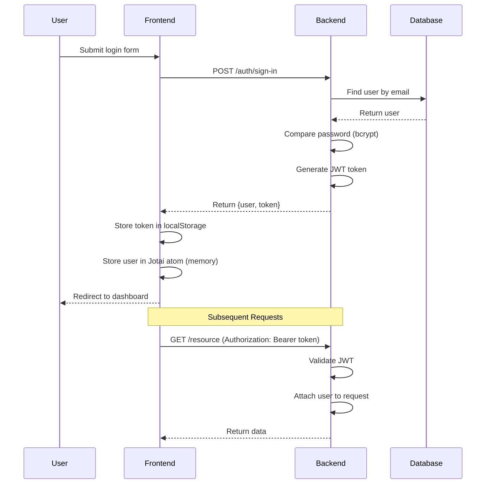
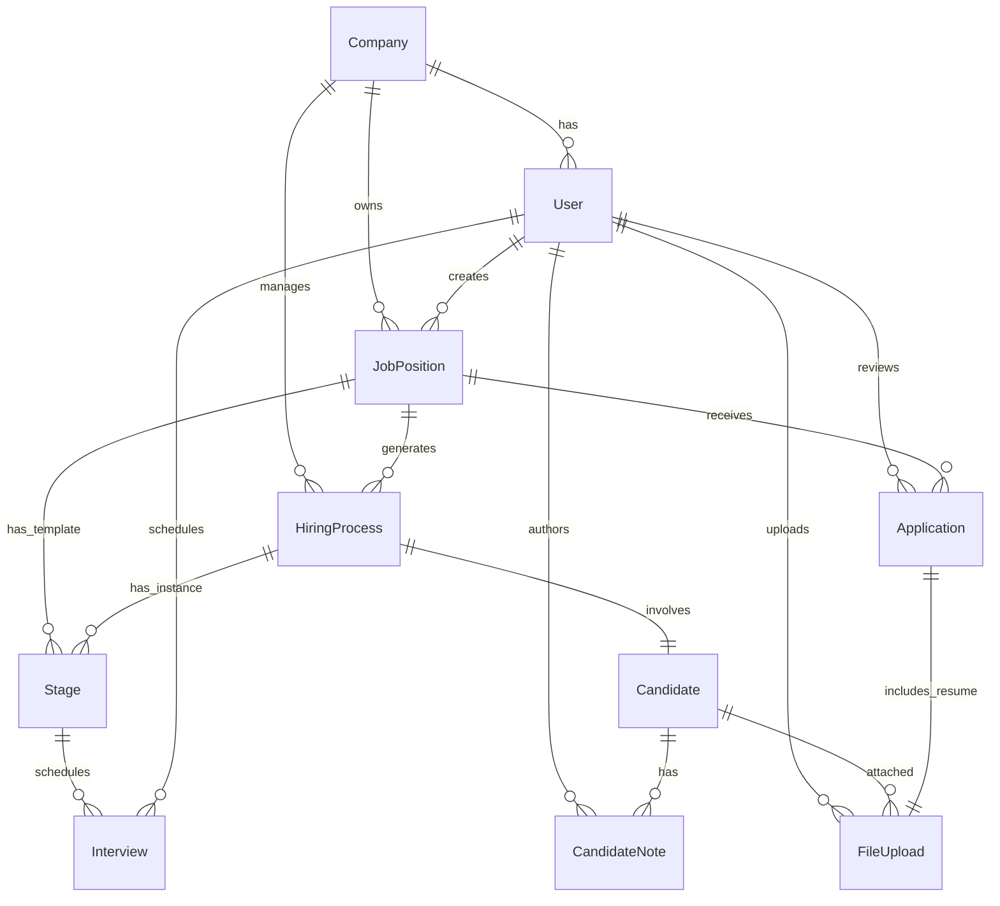
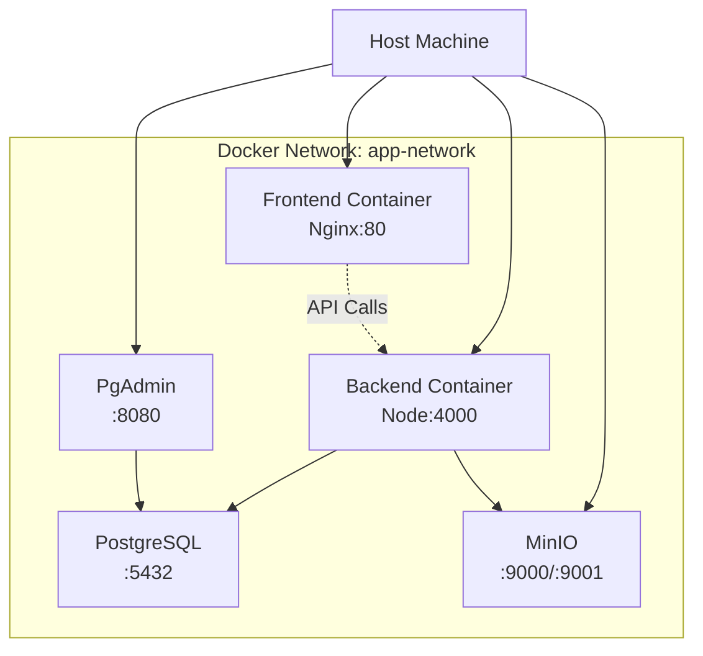
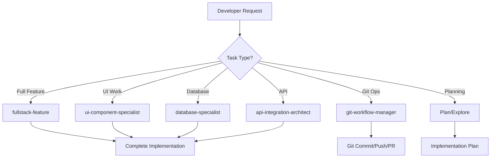

# Architecture Overview

High-level overview of the Recruiting Tool system architecture, design patterns, and component interactions.

## System Architecture

The Recruiting Tool follows a modern **full-stack architecture** with clear separation of concerns:

## Architectural Principles

### 1. Separation of Concerns

**Backend (NestJS)**:
- **Controllers**: Handle HTTP requests/responses
- **Services**: Business logic and data manipulation
- **DTOs**: Data validation and transformation
- **Guards**: Authentication and authorization
- **Decorators**: Cross-cutting concerns

**Frontend (React)**:
- **Pages**: Route-level components
- **Components**: Reusable UI elements
- **Hooks**: Data fetching and state management
- **API Layer**: HTTP client and service functions

### 2. Multi-Tenancy

Company-based isolation ensures data segregation:
- Each user belongs to a company
- Resources filtered by company ID
- Super Admin can manage all companies
- Automatic company context in requests

### 3. Role-Based Access Control (RBAC)

Four-tier role hierarchy:
1. **USER**: Basic access to assigned resources
2. **HR**: Manage candidates, hiring processes, job positions
3. **ADMIN**: Full company management, user creation
4. **SUPER_ADMIN**: Multi-company management, user deletion

### 4. UID-Only External API Policy

All external-facing APIs use UUIDs instead of numeric IDs:
- **Security**: Prevents enumeration attacks
- **Scalability**: Distributed system ready
- **Privacy**: Hides creation order and record count

See [[UID-Policy|UID-Only Policy]] for complete details.

### 5. Type Safety End-to-End

TypeScript throughout the stack:
- Backend: NestJS + Prisma generated types
- Frontend: React + API response types
- DTOs mirror across backend and frontend
- Compile-time error detection

## Application Layers

### Frontend Architecture

**Key Concepts**:
- **Pages**: Route-level components (Dashboard, Candidates, etc.)
- **Layouts**: MainLayout, AdminLayout, DocumentContainer
- **Components**: Reusable UI (dialogs, cards, forms)
- **Hooks**: Data fetching with React Query
- **State**: Jotai for client state, React Query for server state
- **API Layer**: Axios instance with interceptors

See [[Frontend-Architecture|Frontend Architecture]] for details.

### Backend Architecture

**Key Concepts**:
- **Modular Structure**: Each feature as a NestJS module
- **Dependency Injection**: Services injected into controllers
- **Guard-Based Security**: Authentication and authorization layers
- **Prisma ORM**: Type-safe database queries
- **DTO Validation**: Automatic request validation
- **Swagger Docs**: Auto-generated API documentation

See [[Backend-Architecture|Backend Architecture]] for details.

## Data Flow Patterns

### Create Resource Flow

### Read Resource Flow

### Authentication Flow

## Module Organization

### Backend Modules

**Core Modules**:
- `shared/modules/auth`: Authentication & authorization
- `shared/modules/database`: PrismaClient wrapper
- `shared/modules/admin-user`: Bootstrap admin creation

**Feature Modules**:
- `users`: User management
- `company`: Company management (multi-tenancy)
- `job-position`: Job position CRUD
- `hiring-process`: Hiring process workflows
  - `candidate`: Candidate sub-module
  - `stages`: Recruitment stages sub-module
- `application`: External job applications
- `storage`: File upload/download (MinIO/S3)
- `interview`: Interview scheduling
- `dummy`: Development data seeding

See [[Backend-Architecture|Backend Architecture]] for module details.

### Frontend Organization

**Pages** (Route Components):
- `auth`: Login, Signup, Logout
- `dashboard`: Main dashboard
- `admin`: Admin panel pages
  - `applications`: Application management
  - `candidates`: Candidate management
  - `companies`: Company management
  - `users`: User management
- `profile`: User profile
- `hiring-process`: Hiring process detail
- `job-positions`: Job positions list
- `job-position-detail`: Single job position
- `home`: Public home page

**Components** (Reusable):
- `navbar`: Navigation with drawer
- `dialogs`: Modal forms (CRUD operations)
- `cards`: Display cards
- `files`: File upload/download components
- `stages`: Stage visualization components

See [[Frontend-Architecture|Frontend Architecture]] for component details.

## Database Architecture

### Entity Relationship Overview

### Key Relationships

- **Company → Users/JobPositions/HiringProcesses**: Multi-tenancy
- **JobPosition → Stages**: Template for hiring process stages
- **HiringProcess → Stages**: Isolated stage instances per candidate
- **Candidate ↔ HiringProcess**: One-to-one relationship
- **Application → JobPosition**: External applicants
- **Stage → Interview**: Interview scheduling per stage

See [[Database-Schema|Database Schema]] for complete schema.

## API Architecture

### RESTful Design

**Resource Naming**:
- Plural nouns: `/users`, `/candidates`, `/job-positions`
- UID parameters: `/:uid` not `/:id`
- Nested resources: `/candidate/:candidateUid/notes`

**HTTP Methods**:
- `GET`: Retrieve resources (list or single)
- `POST`: Create new resources
- `PUT`: Update existing resources
- `DELETE`: Remove resources

**Status Codes**:
- `200 OK`: Successful GET, PUT
- `201 Created`: Successful POST
- `204 No Content`: Successful DELETE
- `400 Bad Request`: Validation errors
- `401 Unauthorized`: Missing/invalid JWT
- `403 Forbidden`: Insufficient permissions
- `404 Not Found`: Resource not found

See [[API-Overview|API Documentation]] for all endpoints.

## Security Architecture

### Defense in Depth

**Layer 1 - Network**:
- CORS configuration
- Docker network isolation
- Environment-based URLs

**Layer 2 - Authentication**:
- JWT tokens (1-day expiry)
- Bcrypt password hashing (10 rounds)
- Token in Authorization header

**Layer 3 - Authorization**:
- Role-based access control
- Route-level guards
- Company-based data isolation

**Layer 4 - Validation**:
- DTO validation (class-validator)
- Type checking (TypeScript)
- SQL injection prevention (Prisma)

**Layer 5 - Data Protection**:
- UID-only external APIs
- Sensitive data encryption
- Signed URLs for file access

See [[Security-Architecture|Security Architecture]] for details.

## Deployment Architecture

### Docker Compose Stack

**Services**:
1. **frontend**: React app served by Nginx
2. **backend**: NestJS app running on Node.js
3. **db**: PostgreSQL database
4. **minio**: S3-compatible storage
5. **pgadmin**: Database management UI

**Volumes**:
- `pgdata`: PostgreSQL data persistence
- `pgadmin_data`: PgAdmin configuration
- `minio_data`: File storage persistence

See [[Infrastructure|Infrastructure Setup]] for Docker details.

## Performance Considerations

### Backend Optimizations

- **Query Optimization**: Prisma `select` and `include` for field projection
- **Indexing**: Database indexes on frequently queried fields
- **Connection Pooling**: Prisma connection pooling
- **Caching**: Future Redis integration for session caching

### Frontend Optimizations

- **React Query Caching**: 5-minute cache for server data
- **Lazy Loading**: Code splitting for routes (future)
- **Memoization**: React.memo for expensive components
- **Debouncing**: Search inputs and API calls

### Database Optimizations

- **Indexes**: UID fields, foreign keys, frequently filtered fields
- **Transactions**: Atomic operations for stage position management
- **Cascade Deletes**: Automatic cleanup of related records
- **UUID Generation**: Database-level UUID generation

## Scalability Considerations

### Horizontal Scaling

**Backend**:
- Stateless design (JWT, no sessions)
- Multiple backend instances behind load balancer
- Shared PostgreSQL and MinIO

**Database**:
- Read replicas for read-heavy operations
- Connection pooling with PgBouncer
- Partitioning for large tables (future)

**Storage**:
- MinIO cluster mode for high availability
- S3 for production (unlimited scalability)

### Vertical Scaling

- Increase container resources
- PostgreSQL performance tuning
- Node.js cluster mode (backend)

## Development Workflow Architecture

### Agent-Based Development

The project uses specialized AI agents for different development tasks:

See [[Agent-Overview|Agent System]] for complete details.

## Related Notes

- [[Backend-Architecture|Backend Architecture]]
- [[Frontend-Architecture|Frontend Architecture]]
- [[Database-Schema|Database Schema]]
- [[Infrastructure|Infrastructure Setup]]
- [[API-Overview|API Documentation]]
- [[Security-Architecture|Security Architecture]]

## See Also

- [[Technology-Stack|Technology Stack]]
- [[Quick-Start|Quick Start Guide]]
- [[Development-Workflow|Development Workflow]]

---

**Last Updated**: 2025-11-24
**Review Frequency**: After architectural changes
