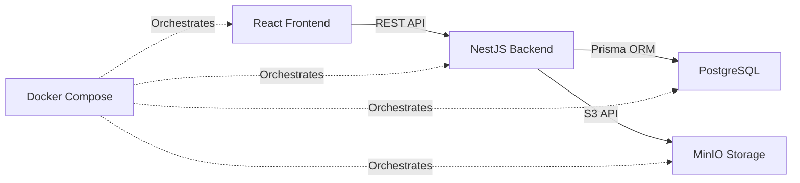

# Technology Stack

Complete overview of all technologies, frameworks, and libraries used in the BorderLess project.

## Architecture Pattern

**Full-Stack Monorepo** with separate backend and frontend applications, orchestrated with Docker.



## Backend Technologies

### Core Framework

| Technology | Version | Purpose |
|------------|---------|---------|
| **NestJS** | 10.0.0 | Modern, scalable Node.js framework with TypeScript |
| **TypeScript** | 5.1.3 | Type-safe JavaScript superset |
| **Node.js** | 18+ | JavaScript runtime environment |

**Why NestJS?**
- Modular architecture with dependency injection
- Built-in support for TypeScript
- Excellent for building scalable APIs
- Decorator-based routing and validation
- Strong community and enterprise adoption

### Database & ORM

| Technology | Version | Purpose |
|------------|---------|---------|
| **PostgreSQL** | Latest | Relational database management system |
| **Prisma** | 6.2.1 | Next-generation ORM with type safety |

**Why Prisma?**
- Type-safe database queries
- Automatic migrations
- Intuitive schema definition
- Excellent TypeScript integration
- Built-in database seeding

### Authentication & Security

| Technology | Version | Purpose |
|------------|---------|---------|
| **@nestjs/jwt** | 11.0.0 | JWT token generation and validation |
| **bcryptjs** | 2.4.3 | Password hashing |
| **class-validator** | 0.14.1 | DTO validation decorators |
| **class-transformer** | 0.5.1 | Object transformation |

**Security Features:**
- JWT-based stateless authentication
- Bcrypt password hashing (salt rounds: 10)
- Role-based access control (RBAC)
- Request validation with DTOs
- Guard-based route protection

### Storage & File Management

| Technology | Version | Purpose |
|------------|---------|---------|
| **MinIO** | Latest | S3-compatible object storage (local) |
| **AWS SDK S3** | Latest | S3 client for MinIO/AWS |

**Storage Strategy:**
- Local development: MinIO (Docker container)
- Production: AWS S3 or compatible service
- Signed URLs for secure temporary access
- File metadata stored in PostgreSQL

### API Documentation

| Technology | Version | Purpose |
|------------|---------|---------|
| **@nestjs/swagger** | 11.0.3 | OpenAPI/Swagger documentation |

**API Docs Available At:** http://localhost:4000/api

## Frontend Technologies

### Core Framework

| Technology | Version | Purpose |
|------------|---------|---------|
| **React** | 19.1.0 | UI library with virtual DOM |
| **TypeScript** | 5.8.3 | Type-safe development |
| **Vite** | 6.3.2 | Fast build tool and dev server |

**Why React 19?**
- Latest features and performance improvements
- Concurrent rendering
- Server components support (future-ready)
- Excellent ecosystem

### Routing

| Technology | Version | Purpose |
|------------|---------|---------|
| **React Router** | 7.5.1 | Client-side routing and navigation |

**Routing Features:**
- Protected routes with authentication guards
- Role-based route access
- Nested layouts (MainLayout, AdminLayout)
- Dynamic route parameters with UIDs

### State Management

| Technology | Version | Purpose |
|------------|---------|---------|
| **Jotai** | 2.15.1 | Atomic state management |
| **TanStack React Query** | 5.74.4 | Server state management & caching |

**State Architecture:**
- **Jotai**: Client-side UI state (user profile, memory-only)
- **React Query**: Server state, caching, and synchronization
- **localStorage**: JWT token persistence only

**Why This Combination?**
- Jotai: Lightweight, atomic state updates
- React Query: Automatic caching, background refetching, optimistic updates
- Clear separation between client and server state

### HTTP Client

| Technology | Version | Purpose |
|------------|---------|---------|
| **Axios** | 1.8.4 | Promise-based HTTP client |

**Axios Configuration:**
- Request interceptor for JWT token injection
- Response interceptor for error handling
- Base URL configuration from environment
- Type-safe request/response with TypeScript

### Forms & Validation

| Technology | Version | Purpose |
|------------|---------|---------|
| **React Hook Form** | 7.56.4 | Performant form management |

**Form Features:**
- Uncontrolled components for performance
- Built-in validation
- Type-safe form data
- Integration with Material-UI

### UI Component Library

| Technology | Version | Purpose |
|------------|---------|---------|
| **Material-UI (MUI)** | 7.0.2 | Comprehensive React UI components |
| **Styled Components** | 6.1.15 | CSS-in-JS styling |
| **Emotion** | 11.14.0 | CSS-in-JS library (MUI dependency) |

**MUI Components Used:**
- Layout: AppBar, Drawer, Container, Grid, Box
- Data Display: Table, Card, List, Accordion
- Inputs: TextField, Select, Button, Checkbox
- Feedback: Dialog, Snackbar, Progress indicators
- Navigation: Tabs, Stepper, Breadcrumbs

### User Experience

| Technology | Version | Purpose |
|------------|---------|---------|
| **React Hot Toast** | 2.6.0 | Toast notifications |
| **date-fns** | Latest | Date formatting and manipulation |

**UX Features:**
- Toast notifications for user feedback
- Loading states with skeletons
- Responsive design (mobile-first)
- Accessible components (ARIA attributes)

### Internationalization

| Technology | Version | Purpose |
|------------|---------|---------|
| **react-i18next** | Latest | i18n framework for React |
| **i18next** | Latest | Internationalization framework |

**i18n Implementation:**
- Translation files: `locales/en.json`, `locales/es.json`
- All UI text must use `t('key')` function
- NO hardcoded text strings allowed
- Language switching support (future feature)

## Infrastructure & DevOps

### Containerization

| Technology | Version | Purpose |
|------------|---------|---------|
| **Docker** | Latest | Application containerization |
| **Docker Compose** | Latest | Multi-container orchestration |

**Docker Services:**
1. **db**: PostgreSQL database
2. **pgadmin**: Database administration UI
3. **backend**: NestJS application
4. **frontend**: React application (Nginx)
5. **minio**: Object storage

### Database Tools

| Technology | Version | Purpose |
|------------|---------|---------|
| **PgAdmin** | 8 | PostgreSQL administration interface |
| **Prisma Studio** | Included | Database GUI (via Prisma CLI) |

**Access:**
- PgAdmin: http://localhost:8080
- Prisma Studio: `npx prisma studio`

## Development Tools

### Package Management

| Technology | Purpose |
|------------|---------|
| **Yarn** | Package manager (REQUIRED) |

> **CRITICAL**: This project uses **Yarn exclusively**. Never use npm commands.

### Code Quality

| Technology | Purpose |
|------------|---------|
| **ESLint** | JavaScript/TypeScript linting |
| **Prettier** | Code formatting |
| **TypeScript Compiler** | Type checking (`tsc --noEmit`) |

**Quality Commands:**
```bash
# Type check
yarn typecheck

# Lint
yarn lint

# Format
yarn format
```

## Version Control & CI/CD

### Repository Hosting

- **GitHub**: Source code repository
- **GitHub Issues**: Task and bug tracking
- **GitHub Milestones**: Feature planning
- **GitHub Actions**: CI/CD automation (future)

### Branch Strategy

- **production**: Production-ready code
- **development**: Integration branch for features
- **feature/***: Feature development branches

## External Services (Future Integration)

| Service | Purpose | Status |
|---------|---------|--------|
| **SendGrid** | Email notifications | Planned |
| **Google Calendar** | Interview scheduling | Planned |
| **Stripe** | Payment processing | Future |
| **AWS S3** | Production file storage | Configurable |

## Technology Decision Matrix

### Why These Technologies?

| Requirement | Technology Choice | Reasoning |
|-------------|-------------------|-----------|
| Type Safety | TypeScript | Catch errors at compile time, better IDE support |
| Backend Framework | NestJS | Scalable, modular, enterprise-ready |
| Frontend Framework | React 19 | Latest features, huge ecosystem, job market demand |
| Database | PostgreSQL | ACID compliance, relational data, proven at scale |
| ORM | Prisma | Type-safe queries, excellent DX, modern tooling |
| State Management | Jotai + React Query | Lightweight, atomic state + server cache separation |
| UI Library | Material-UI | Comprehensive, customizable, accessible |
| Storage | MinIO/S3 | Industry standard, scalable, local dev friendly |
| Containerization | Docker | Consistent environments, easy deployment |

## Version Matrix

### Minimum Required Versions

- Node.js: 18.0.0 or higher
- Yarn: 1.22.0 or higher
- Docker: 20.10.0 or higher
- Docker Compose: 2.0.0 or higher

### Current Production Versions

See `package.json` files in:
- `recruiting-tool-backend/package.json`
- `recruiting-tool-frontend/package.json`

## Migration Path & Upgrades

### Planned Upgrades

- React 19: Already on latest
- NestJS: Monitor for v11 release
- Prisma: Keep updated with minor versions
- Material-UI: Stay on v7.x for stability

### Breaking Change Monitoring

Key dependencies to watch for breaking changes:
- React (major versions)
- NestJS (major versions)
- Prisma (major versions)
- React Router (major versions)

## Performance Considerations

### Backend Optimizations

- Prisma query optimization with `select` and `include`
- Database indexing on frequently queried fields
- JWT token caching
- Connection pooling with Prisma

### Frontend Optimizations

- React Query caching (5-minute default)
- Code splitting with React.lazy (future)
- Image optimization with MinIO/S3
- Vite build optimization

## Security Stack

### Authentication Flow

1. User submits credentials
2. Backend validates with bcrypt
3. JWT token generated (1-day expiry)
4. Token stored in localStorage (frontend)
5. Token sent in Authorization header
6. Backend validates with JWT strategy
7. User attached to request object

### Authorization Layers

1. **Route Guards**: AuthGuard validates JWT
2. **Role Guards**: RolesGuard checks user roles
3. **Decorators**: `@Auth([roles])` combines guards
4. **DTOs**: Validate incoming data
5. **UID Policy**: Prevent ID enumeration

## Related Notes

- [[Architecture-Overview|Architecture Overview]]
- [[Backend-Architecture|Backend Architecture]]
- [[Frontend-Architecture|Frontend Architecture]]
- [[Database-Schema|Database Schema]]
- [[Infrastructure|Infrastructure Setup]]

## See Also

- [[Quick-Start|Quick Start Guide]] - Get started with development
- [[Environment-Variables|Environment Variables]] - Configuration reference
- [[Docker-Workflow|Docker Workflow]] - Container management

---

**Last Updated**: 2025-11-24
**Review Frequency**: After major version upgrades
