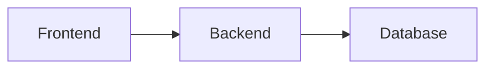

# Getting Started with the Documentation Vault

This guide will help you start using the BorderLess documentation vault in Obsidian.

## What is Obsidian?

Obsidian is a powerful knowledge base application that works on top of a folder of plain text Markdown files. It allows you to create interconnected notes with bidirectional links, visualize connections, and search across all your documentation.

**Download Obsidian**: https://obsidian.md/download

## Opening the Vault

### Step 1: Install Obsidian

1. Download Obsidian from https://obsidian.md/download
2. Install the application for your operating system
3. Launch Obsidian

### Step 2: Open the Vault

**Option 1 - From Obsidian**:
1. Click "Open folder as vault"
2. Navigate to: `C:\Users\empas\Desktop\Proyectos propios\RecruitingTool\docs-vault`
3. Click "Open"

**Option 2 - From File Explorer**:
1. Navigate to: `C:\Users\empas\Desktop\Proyectos propios\RecruitingTool\docs-vault`
2. Right-click the folder
3. Select "Open in Obsidian" (if Obsidian is installed)

### Step 3: Trust the Vault

Obsidian may ask if you trust the vault author:
- Click "Trust author and enable plugins"
- This allows Obsidian features to work properly

## First Steps in the Vault

### 1. Read the README

Start by reading `README.md` - it's the home page of the vault and provides an overview of the documentation structure.

### 2. Explore the Quick Start

Open `00-Index/Quick-Start.md` to learn how to set up the development environment.

### 3. Check the Architecture Overview

Read `00-Index/Architecture-Overview.md` to understand the system design.

### 4. Review Critical Standards

Open `07-Coding-Standards/UID-Policy.md` - this is a CRITICAL standard that must be followed.

## Obsidian Features to Use

### 1. Graph View

**What**: Visual representation of all notes and their connections
**How to Access**:
- Click the graph icon in the left sidebar
- Or press `Ctrl + G` (Windows/Linux) or `Cmd + G` (Mac)

**What You'll See**:
- Nodes (circles) represent notes
- Lines represent links between notes
- Larger nodes have more connections
- Colors represent different categories

**Use Cases**:
- Visualize documentation structure
- Identify highly connected topics
- Find documentation gaps
- Explore related topics

### 2. Search

**What**: Search across all notes
**How to Access**:
- Press `Ctrl + O` (Windows/Linux) or `Cmd + O` (Mac)
- Or use the search icon in the left sidebar

**Search Features**:
- Full-text search across all files
- Search in filenames
- Search by tags
- Search by folder

**Pro Tips**:
- Use quotes for exact phrases: `"UID policy"`
- Use `tag:` to search by tag: `tag:backend`
- Use `path:` to search in folder: `path:Architecture`

### 3. Backlinks

**What**: See what other notes link to the current note
**How to Access**:
- Open any note
- Look at the right sidebar
- Find "Backlinks" section

**Use Cases**:
- See what topics relate to current note
- Find unexpected connections
- Navigate between related docs

### 4. Tags

**What**: Categorize and filter notes by tags
**How to Access**:
- Click the tag icon in the left sidebar
- Or look for tags in the right sidebar

**Available Tags**:
- `#backend` - Backend-related documentation
- `#frontend` - Frontend-related documentation
- `#architecture` - Architecture documentation
- `#api` - API documentation
- `#database` - Database documentation
- `#agents` - Agent system documentation
- `#workflow` - Development workflow docs
- `#coding-standards` - Coding standards

**Use Cases**:
- Filter notes by topic
- Find all backend documentation
- See all API-related notes

### 5. Quick Switcher

**What**: Quickly switch between notes
**How to Access**: `Ctrl + O` (Windows/Linux) or `Cmd + O` (Mac)

**Use Cases**:
- Jump to any note quickly
- No need to navigate folders
- Type note name and press Enter

### 6. Command Palette

**What**: Access all Obsidian commands
**How to Access**: `Ctrl + P` (Windows/Linux) or `Cmd + P` (Mac)

**Common Commands**:
- "Toggle left sidebar"
- "Toggle right sidebar"
- "Open graph view"
- "Open daily note"

### 7. Outline

**What**: See the structure of the current note
**How to Access**:
- Look at the right sidebar
- Find "Outline" section

**Use Cases**:
- Navigate long documents
- See document structure
- Jump to specific sections

### 8. Reading Mode vs Editing Mode

**Reading Mode**:
- Press `Ctrl + E` (Windows/Linux) or `Cmd + E` (Mac)
- Clean reading experience
- Links are clickable
- Diagrams are rendered

**Editing Mode**:
- Press `Ctrl + E` again to toggle back
- Edit the Markdown
- See raw formatting
- Make changes to documentation

**Live Preview Mode**:
- Best of both worlds
- Edit and see rendered at the same time
- Default mode for this vault

## Navigation Patterns

### Follow the Trail

Start with high-level concepts and drill down:
1. **README.md** - Vault overview
2. **Quick-Start.md** - Getting started
3. **Architecture-Overview.md** - System design
4. **Backend-Architecture.md** - Deep dive into backend

### Use Breadcrumbs

Look for "Related Notes" sections at the bottom of each note:
- These link to related topics
- Follow the trail of related notes
- Build comprehensive understanding

### Use Tags to Filter

1. Click tag icon in left sidebar
2. Click a tag (e.g., `#backend`)
3. See all backend-related notes
4. Click a note to open it

### Use Search for Specific Topics

1. Press `Ctrl + O` or `Cmd + O`
2. Type your search term
3. See matching notes and content
4. Click to open

## Understanding the Structure

### Folder Organization

```
docs-vault/
├── 00-Index/              # Start here - high-level overviews
├── 01-Architecture/       # System architecture details
├── 02-Features/           # Feature documentation (to be added)
├── 03-API/                # API documentation (to be added)
├── 04-Database/           # Database documentation (to be added)
├── 05-Components/         # Component documentation (to be added)
├── 06-Workflows/          # Development workflows (to be added)
├── 07-Coding-Standards/   # Coding standards and conventions
├── 08-Agents/             # Agent system documentation
├── 09-Reference/          # Quick reference materials (to be added)
└── 99-Templates/          # Documentation templates (to be added)
```

### Numbering System

Folders are numbered for logical reading order:
- **00-Index**: Start here
- **01-Architecture**: Understand the system
- **02-Features**: Learn what's built
- **03-API**: API reference
- And so on...

### File Naming

Files use hyphens and title case:
- ✅ `Quick-Start.md`
- ✅ `Backend-Architecture.md`
- ✅ `UID-Policy.md`
- ❌ `quick_start.md`
- ❌ `backend_architecture.md`

## Reading the Documentation

### YAML Frontmatter

Each note starts with YAML frontmatter:

```yaml
---
tags: [tag1, tag2, tag3]
created: 2025-11-24
updated: 2025-11-24
category: CategoryName
status: current
---
```

This metadata helps with:
- **Tags**: Categorization and filtering
- **Created**: When the note was created
- **Updated**: Last update date
- **Category**: Type of documentation
- **Status**: current, draft, or deprecated

### Note Structure

Most notes follow this structure:
1. **Title**: Main topic (H1)
2. **Overview**: Brief introduction
3. **Main Content**: Detailed information with sections (H2, H3)
4. **Code Examples**: Syntax-highlighted code blocks
5. **Diagrams**: Mermaid diagrams for visual representation
6. **Related Notes**: Links to related topics
7. **See Also**: Additional resources
8. **Footer**: Last updated date, review frequency

### Code Blocks

Code is syntax-highlighted:

```typescript
// Example TypeScript code
interface User {
  uid: string;
  name: string;
  email: string;
}
```

### Diagrams

Mermaid diagrams are rendered in reading mode:



### Callouts

Important information is highlighted:

> **Note**: This is important information
>
> **Warning**: Pay attention to this
>
> **Tip**: Helpful suggestion

### WikiLinks

Internal links use double brackets:
- `[[Quick-Start]]` - Link to Quick-Start.md
- `[[Backend-Architecture|Backend]]` - Link with custom text

## Common Tasks

### Finding Specific Information

**Example**: "How do I set up Docker?"
1. Press `Ctrl + O`
2. Type "docker"
3. Open "Quick-Start.md"
4. Look for Docker section

**Example**: "What is the UID policy?"
1. Press `Ctrl + O`
2. Type "uid"
3. Open "UID-Policy.md"
4. Read the overview

**Example**: "How does authentication work?"
1. Press `Ctrl + O`
2. Type "auth"
3. Check "Backend-Architecture.md" or "Architecture-Overview.md"

### Learning a New Topic

**Example**: "I want to understand the backend"
1. Start with `Architecture-Overview.md`
2. Read the Backend Architecture section
3. Follow link to `Backend-Architecture.md`
4. Read module-by-module
5. Check related notes at bottom

### Exploring Related Topics

**Method 1 - Follow Links**:
1. Open any note
2. Click [[WikiLinks]] to related notes
3. Continue following links of interest

**Method 2 - Use Graph View**:
1. Open graph view (`Ctrl + G`)
2. Click a node to open that note
3. See connected nodes highlighted

**Method 3 - Use Backlinks**:
1. Open any note
2. Check "Backlinks" in right sidebar
3. See what other notes reference this one

### Quick Reference Lookup

**Example**: "What's the syntax for creating a DTO?"
1. Press `Ctrl + O`
2. Type "backend architecture"
3. Open note and search for "DTO" (`Ctrl + F`)
4. Find example code

## Keyboard Shortcuts

### Essential Shortcuts

| Action | Windows/Linux | Mac |
|--------|---------------|-----|
| Quick switcher | `Ctrl + O` | `Cmd + O` |
| Search | `Ctrl + Shift + F` | `Cmd + Shift + F` |
| Command palette | `Ctrl + P` | `Cmd + P` |
| Graph view | `Ctrl + G` | `Cmd + G` |
| Toggle edit/read | `Ctrl + E` | `Cmd + E` |
| Follow link | `Ctrl + Click` | `Cmd + Click` |
| New note | `Ctrl + N` | `Cmd + N` |

### Navigation Shortcuts

| Action | Shortcut |
|--------|----------|
| Back | `Ctrl + Alt + ←` |
| Forward | `Ctrl + Alt + →` |
| Toggle sidebar | `Ctrl + Shift + \` |

## Tips for Effective Use

### 1. Start with the Index

Always begin with `00-Index/` notes for high-level understanding.

### 2. Use Graph View for Exploration

When learning a new area, open graph view to see related topics.

### 3. Bookmark Critical Notes

Star frequently referenced notes:
- `UID-Policy.md` (CRITICAL standard)
- `Quick-Start.md` (setup reference)
- `Agent-Overview.md` (agent usage)

### 4. Use Tags to Filter

When working on specific areas (backend, frontend), filter by tags.

### 5. Search Before Asking

Use search to find answers before asking others.

### 6. Follow the Trail

Use "Related Notes" sections to build comprehensive understanding.

### 7. Read in Order

For new developers, read in this order:
1. README.md
2. Quick-Start.md
3. Technology-Stack.md
4. Architecture-Overview.md
5. UID-Policy.md (CRITICAL)
6. Agent-Overview.md
7. Backend-Architecture.md

## Troubleshooting

### Links Don't Work

**Problem**: Clicking a link shows "Note does not exist"
**Solution**: The note hasn't been created yet. Check VAULT-SUMMARY.md for what needs to be added.

### Diagrams Don't Render

**Problem**: Mermaid diagrams show as code
**Solution**: Switch to Reading mode (`Ctrl + E`)

### Can't Find a Note

**Problem**: Search doesn't find expected note
**Solution**:
1. Check if note exists in folder structure
2. Try searching by tag instead
3. Check VAULT-SUMMARY.md for planned notes

### Vault is Empty

**Problem**: Obsidian shows empty vault
**Solution**:
1. Ensure you opened the correct folder (docs-vault)
2. Close and reopen Obsidian
3. Check folder permissions

## Getting Help

### Within the Vault

- **README.md**: Vault overview
- **VAULT-SUMMARY.md**: What's documented and what's not
- **Quick-Start.md**: Development setup
- **Agent-Overview.md**: Using the agent system

### External Resources

- **Obsidian Help**: https://help.obsidian.md/
- **Obsidian Forum**: https://forum.obsidian.md/
- **Project GitHub**: https://github.com/Nikire/RecruitingTool

### Project Documentation

- **CLAUDE.md**: Quick reference in project root
- **.claude/docs/**: Detailed documentation files
- **GitHub Issues**: https://github.com/Nikire/RecruitingTool/issues

## Next Steps

### For New Developers

1. ✅ Open vault in Obsidian
2. ✅ Read this guide
3. → Read [[README]]
4. → Follow [[Quick-Start]]
5. → Review [[UID-Policy]]
6. → Explore [[Agent-Overview]]

### For Experienced Developers

1. ✅ Open vault in Obsidian
2. → Use as reference material
3. → Search for specific topics as needed
4. → Contribute to vault expansion

### For Technical Leads

1. ✅ Open vault in Obsidian
2. → Review architecture documentation
3. → Use for onboarding new developers
4. → Plan vault expansion (see VAULT-SUMMARY.md)

---

**Ready to Start?** Open [[README]] to begin exploring the vault!
