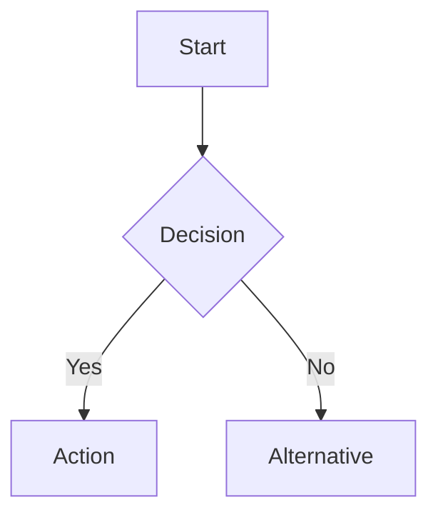
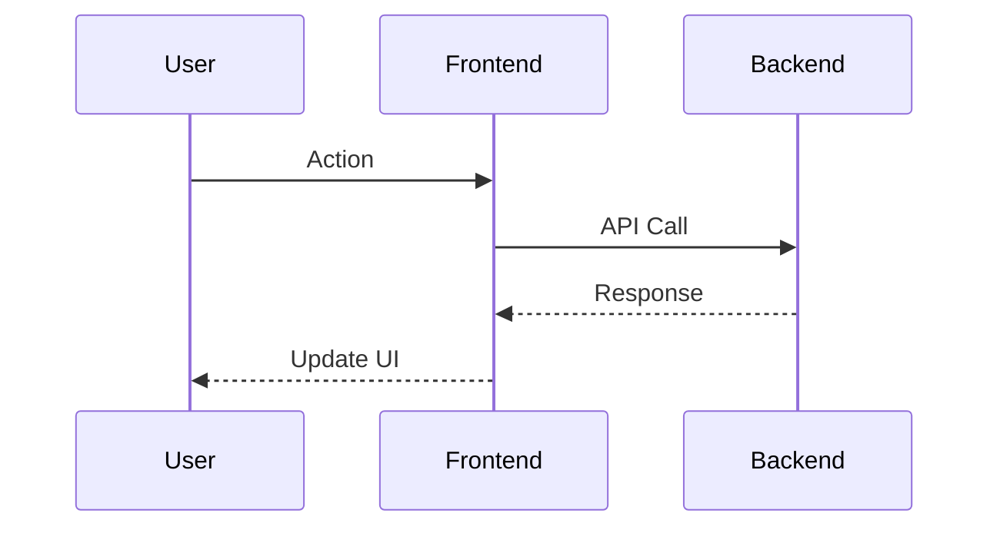
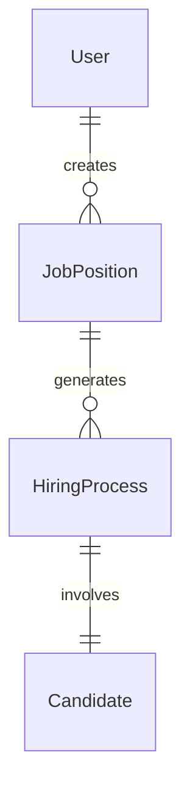

# Recruiting Tool Documentation Vault - Summary

## What Was Created

This Obsidian.md vault provides comprehensive documentation for the Recruiting Tool project. The vault is organized into logical sections with rich interconnections between related topics.

## Vault Location

**Path**: `C:\Users\empas\Desktop\Proyectos propios\RecruitingTool\docs-vault\`

## Vault Structure

### Created Folders and Files

```
docs-vault/
├── README.md                              # Vault overview and navigation
├── VAULT-SUMMARY.md                       # This file
│
├── 00-Index/                              # High-level overview pages
│   ├── Quick-Start.md                     # Getting started guide
│   ├── Technology-Stack.md                # Complete tech stack overview
│   └── Architecture-Overview.md           # System architecture overview
│
├── 01-Architecture/                       # Architecture documentation
│   └── Backend-Architecture.md            # Complete backend documentation
│
├── 07-Coding-Standards/                   # Coding standards
│   └── UID-Policy.md                      # CRITICAL UID-only policy
│
└── 08-Agents/                             # Agent system documentation
    └── Agent-Overview.md                  # Complete agent documentation
```

## Key Documentation Created

### 1. README.md (Vault Home)

**Purpose**: Main entry point for the vault
**Contents**:
- Vault overview and purpose
- Navigation methods (links, search, graph view)
- Project overview
- Vault organization
- Key features documented
- Maintenance guidelines

**Start Here**: This is the first file users should read when opening the vault.

### 2. Quick-Start.md

**Purpose**: Get developers up and running quickly
**Contents**:
- Prerequisites and setup
- Environment variable configuration
- Docker commands
- Package management (Yarn-only)
- Database operations
- Type checking
- Project structure overview
- Development workflow
- Common tasks
- Troubleshooting

**Target Audience**: New developers joining the project

### 3. Technology-Stack.md

**Purpose**: Comprehensive overview of all technologies used
**Contents**:
- Architecture pattern with Mermaid diagram
- Backend technologies (NestJS, Prisma, PostgreSQL, JWT)
- Frontend technologies (React 19, Vite, Material-UI, React Query, Jotai)
- Infrastructure (Docker, MinIO)
- Development tools
- Version matrix
- Technology decision matrix
- Performance considerations
- Security stack

**Target Audience**: Developers wanting to understand the tech choices

### 4. Architecture-Overview.md

**Purpose**: High-level system architecture and design patterns
**Contents**:
- System architecture diagram
- Architectural principles (separation of concerns, multi-tenancy, RBAC, UID-policy)
- Application layers (frontend + backend)
- Data flow patterns with sequence diagrams
- Module organization
- Database architecture with ERD
- API architecture
- Security architecture (defense in depth)
- Deployment architecture
- Performance and scalability considerations
- Agent-based development workflow

**Target Audience**: Architects, senior developers, technical leads

### 5. Backend-Architecture.md

**Purpose**: Complete backend implementation documentation
**Contents**:
- Technology stack
- Detailed folder structure
- Module architecture (Auth, Database, Admin User, Users, Company, Job Position, Hiring Process, Candidate, Stages, Application, Storage, Interview, Dummy)
- Design patterns (DI, DTO, Mapper, Guard, Repository)
- Error handling
- Validation
- API documentation (Swagger)
- Testing strategy
- Performance considerations

**Target Audience**: Backend developers

### 6. UID-Policy.md (CRITICAL)

**Purpose**: Enforce UID-only external API policy
**Contents**:
- Overview and rationale (security, scalability)
- Implementation layers (database, service, controller, DTO, mapper, frontend)
- Complete examples for each layer
- End-to-end flow example
- Migration checklist
- Common mistakes to avoid
- Verification commands

**Status**: CRITICAL - Must be followed at all times
**Target Audience**: All developers working on backend or frontend

### 7. Agent-Overview.md

**Purpose**: Document the specialized agent system
**Contents**:
- Agent philosophy (global permissions model)
- Agent selection workflow
- Core development agents (fullstack-feature, ui-component-specialist, database-specialist, state-optimizer, api-integration-architect)
- Infrastructure agents (devops-specialist)
- Analysis agents (Explore, Plan, codebase-analyzer)
- Project management agents (task-orchestrator, git-workflow-manager, agent-orchestrator)
- Product agents (product-brainstorming)
- Documentation agents (claude-code-guide)
- Agent selection examples
- Agent behavior policies (i18n, activity logging)
- Best practices
- Troubleshooting

**Target Audience**: All developers using the agent system

## Documentation Coverage

### What's Fully Documented

✅ **Project Setup**:
- Environment configuration
- Docker setup
- Package management
- Initial deployment

✅ **Architecture**:
- System architecture overview
- Backend architecture (complete)
- Technology stack
- Design patterns

✅ **Development**:
- Quick start guide
- Development workflow basics
- Agent system (complete)

✅ **Standards**:
- UID-only policy (complete and critical)
- Package management (Yarn-only)
- Docker workflow basics

### What Needs Additional Documentation

The following areas should be expanded with additional notes:

📝 **Frontend Architecture**:
- Create: `01-Architecture/Frontend-Architecture.md`
- Content: React architecture, component structure, state management, routing

📝 **Database Schema**:
- Create: `04-Database/Database-Schema.md`
- Content: Complete Prisma schema, models, relations, constraints

📝 **API Documentation**:
- Create: `03-API/API-Overview.md`
- Create: `03-API/Authentication.md`
- Create: `03-API/Endpoints-by-Module.md`
- Content: All API endpoints with examples

📝 **Features**:
- Create: `02-Features/Feature-Overview.md`
- Create: `02-Features/Feature-Roadmap.md`
- Content: Implemented features, planned features

📝 **Workflows**:
- Create: `06-Workflows/Development-Workflow.md`
- Create: `06-Workflows/Docker-Workflow.md`
- Create: `06-Workflows/Git-Workflow.md`
- Content: Detailed workflows from `.claude/docs/WORKFLOWS.md`

📝 **Components**:
- Create: `05-Components/Component-Overview.md`
- Create: `05-Components/Material-UI-Theme.md`
- Content: React components, dialogs, forms, cards

📝 **Infrastructure**:
- Create: `01-Architecture/Infrastructure.md`
- Content: Docker setup, MinIO, PostgreSQL, PgAdmin

📝 **Security**:
- Create: `01-Architecture/Security-Architecture.md`
- Content: Authentication, authorization, RBAC, JWT

📝 **Coding Standards**:
- Create: `07-Coding-Standards/i18n-Requirements.md`
- Create: `07-Coding-Standards/Coding-Standards-Overview.md`
- Content: i18n policy, TypeScript standards, commit format

📝 **Reference**:
- Create: `09-Reference/File-Structure.md`
- Create: `09-Reference/Environment-Variables.md`
- Create: `09-Reference/Key-Files.md`
- Content: Quick reference materials

📝 **Templates**:
- Create: `99-Templates/Feature-Template.md`
- Create: `99-Templates/API-Endpoint-Template.md`
- Create: `99-Templates/Component-Template.md`
- Content: Reusable documentation templates

## How to Expand This Vault

### Adding New Documentation

1. **Determine Category**: Choose appropriate folder (Architecture, Features, API, etc.)
2. **Create Note**: Use YAML frontmatter with tags, created date, category
3. **Add Content**: Follow existing structure with Overview, Details, Related Notes
4. **Add Links**: Link to related notes bidirectionally
5. **Update Index**: Add links from index pages and README
6. **Add Diagrams**: Use Mermaid for visual representation when helpful

### YAML Frontmatter Template

```yaml
---
tags: [tag1, tag2, tag3]
created: YYYY-MM-DD
updated: YYYY-MM-DD
category: CategoryName
status: current|draft|deprecated
---
```

### Note Structure Template

```markdown
# Title

Brief overview of what this note covers.

## Main Section

Content with code examples, diagrams, and explanations.

## Related Notes

- [[Note-1|Link to related note]]
- [[Note-2|Link to related note]]
- [[Note-3|Link to related note]]

## See Also

- [[Additional-Resource|Additional resource]]

---

**Last Updated**: YYYY-MM-DD
**Review Frequency**: When to review this note
```

### Adding Mermaid Diagrams

Use Mermaid for visual documentation:

**Flowcharts**:


**Sequence Diagrams**:


**Entity Relationship Diagrams**:


## Using This Vault

### Navigation Methods

1. **Click Links**: Follow [[WikiLinks]] between notes
2. **Search**: Ctrl/Cmd + O for quick search
3. **Graph View**: Ctrl/Cmd + G to visualize connections
4. **Backlinks**: See what links to current note
5. **Tags**: Filter by tags like #backend, #frontend, #api

### Finding Information

**For Setup**:
→ Start with [[Quick-Start]]

**For Architecture**:
→ Read [[Architecture-Overview]]
→ Deep dive: [[Backend-Architecture]]

**For Standards**:
→ CRITICAL: [[UID-Policy]]

**For Development**:
→ Use [[Agent-Overview]]
→ Check [[Technology-Stack]]

**For Specific Topics**:
→ Use Obsidian search (Ctrl/Cmd + O)

### Obsidian Features to Use

**Graph View**:
- Visualize note connections
- Identify documentation gaps
- See related topics

**Backlinks Panel**:
- See what pages reference current note
- Find unexpected connections
- Verify documentation completeness

**Tag Pane**:
- Browse by category
- Filter by status (current, draft, deprecated)
- Find related topics

**Starred Notes**:
- Star frequently referenced notes
- Quick access to critical standards
- Bookmark work-in-progress notes

## Maintenance Guidelines

### When to Update Vault

Update documentation when:
- ✅ New features are implemented
- ✅ Architecture changes occur
- ✅ APIs are added or modified
- ✅ Database schema changes
- ✅ Development workflows evolve
- ✅ New agents are created
- ✅ Coding standards change

### Update Checklist

For each significant change:
- [ ] Update relevant note content
- [ ] Update `updated` date in frontmatter
- [ ] Add or update diagrams if needed
- [ ] Update related notes
- [ ] Check bidirectional links
- [ ] Update index pages if structure changed
- [ ] Review and update README if needed

### Keep in Sync

This vault should stay synchronized with:
- `.claude/docs/` folder (source of truth for detailed docs)
- `CLAUDE.md` (quick reference)
- `CHANGELOG.md` (version history)
- GitHub Issues and Milestones (roadmap)

## Future Enhancements

### Planned Additions

1. **Complete Frontend Documentation**:
   - Frontend architecture
   - Component library
   - State management patterns
   - Routing and navigation

2. **Complete API Documentation**:
   - All endpoints by module
   - Request/response examples
   - Authentication flows
   - Error handling

3. **Complete Database Documentation**:
   - Full schema reference
   - Migration strategies
   - Query optimization
   - Data integrity rules

4. **Development Workflows**:
   - Git workflow (branches, commits, PRs)
   - Docker workflow (detailed)
   - Testing workflow
   - Deployment workflow

5. **Feature Documentation**:
   - Implemented features
   - Feature roadmap
   - User guides

6. **Component Documentation**:
   - React component hierarchy
   - Material-UI customization
   - Dialog patterns
   - Form patterns

7. **Security Documentation**:
   - Complete security architecture
   - Authentication deep dive
   - Authorization patterns
   - Security best practices

8. **Reference Materials**:
   - File structure reference
   - Environment variables
   - Key files and entry points
   - Troubleshooting guide

### Enhancements

- Add more Mermaid diagrams for visual learning
- Create templates for common documentation patterns
- Add examples and code snippets to all notes
- Create video tutorials (link in vault)
- Add external resource links
- Create glossary of terms
- Add FAQ section

## Benefits of This Vault

### For New Developers

- **Quick Onboarding**: Start with Quick-Start guide
- **Visual Learning**: Mermaid diagrams show architecture
- **Connected Knowledge**: Links show relationships between concepts
- **Searchable**: Find any topic quickly
- **Comprehensive**: All aspects of the project documented

### For Experienced Developers

- **Reference**: Quick lookup for APIs, standards, workflows
- **Architecture Understanding**: Deep dive into system design
- **Agent Efficiency**: Know which agent to use for tasks
- **Standards Enforcement**: CRITICAL policies clearly documented
- **Maintenance**: Easy to update and keep current

### For Technical Leads

- **Documentation Hub**: Single source of truth
- **Onboarding Tool**: Train new team members
- **Knowledge Sharing**: Share context across team
- **Decision Making**: See technology choices and rationale
- **Planning**: Use for architecture decisions

## Getting Help

### Issues with Vault

**Can't open vault in Obsidian**:
1. Open Obsidian
2. Click "Open folder as vault"
3. Select `docs-vault` folder

**Links not working**:
- Ensure note filenames match link text
- Use Obsidian's link autocomplete (type `[[` and start typing)

**Diagrams not rendering**:
- Obsidian supports Mermaid natively
- Check for syntax errors in diagram code

### Contributing to Vault

To add or improve documentation:
1. Follow the structure and patterns in existing notes
2. Use YAML frontmatter
3. Add bidirectional links
4. Include code examples
5. Add diagrams where helpful
6. Update index pages

## Project Information

- **Project**: Recruiting Tool
- **Repository**: https://github.com/Nikire/RecruitingTool
- **Vault Created**: 2025-11-24
- **Vault Location**: `docs-vault/` in project root
- **Last Updated**: 2025-11-24

## Related Resources

- **Quick Reference**: `CLAUDE.md` in project root
- **Detailed Documentation**: `.claude/docs/` folder
- **Version History**: `CHANGELOG.md`
- **GitHub Issues**: https://github.com/Nikire/RecruitingTool/issues
- **GitHub Milestones**: https://github.com/Nikire/RecruitingTool/milestones

---

## Next Steps

### For Completing the Vault

1. **Create Frontend Architecture Documentation**
2. **Create Database Schema Documentation**
3. **Create API Documentation**
4. **Create Workflow Documentation**
5. **Create Feature Documentation**
6. **Create Component Documentation**
7. **Create Reference Materials**
8. **Create Templates**

### Start Using the Vault

1. **Open in Obsidian**: File → Open folder as vault → Select `docs-vault`
2. **Read README.md**: Understand vault organization
3. **Start with Quick-Start**: Get project running
4. **Explore Graph View**: Visualize connections
5. **Bookmark Critical Notes**: Star [[UID-Policy]] and [[Agent-Overview]]

---

**Vault Status**: Foundation Complete, Ready for Expansion
**Documentation Coverage**: ~30% (core architecture and standards documented)
**Recommended Next Step**: Create Frontend-Architecture.md and Database-Schema.md
